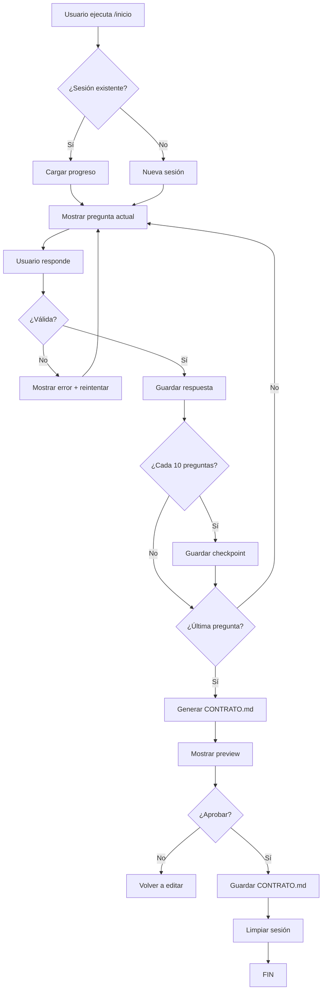

# SPEC — Cuestionario Interactivo CONTRATO.md

> **Fase 2:** Implementación del sistema de generación automática de CONTRATO.md vía cuestionario interactivo.

---

## 📋 Decisiones Aprobadas

✅ **A) Formato:** Markdown + YAML frontmatter  
✅ **B) Guardado:** Parcial cada 10 preguntas  
✅ **C) Jira:** Plan + confirmación antes de crear  
✅ **D) Orden:** Cuestionario → Parser → Jira  

**Fecha aprobación:** 2026-02-25 14:02 GMT+0

---

## 🎯 Objetivo

Crear un cuestionario interactivo de **56 preguntas** que:

1. Recopile información del proyecto
2. Valide respuestas (tipos, opciones válidas, dependencias)
3. Guarde progreso parcial cada 10 preguntas
4. Genere `CONTRATO.md` con YAML frontmatter completo
5. Permita reanudar si se interrumpe

---

## 🏗️ Arquitectura

### Componentes

```
scripts/
├── generate-contrato.sh          # Script principal (Bash interactivo)
├── lib/
│   ├── questions.json            # 56 preguntas + validaciones
│   ├── validate.sh               # Funciones de validación
│   └── templates/
│       └── contrato-template.md  # Template con placeholders
└── .sessions/                    # Guardado parcial
    └── {session-id}.json         # Respuestas parciales

.commands/
└── inicio.md                     # Integración con comando /inicio
```

### Flujo General



---

## 📝 Estructura `questions.json`

```json
{
  "metadata": {
    "version": "1.0",
    "total_questions": 56,
    "checkpoint_interval": 10
  },
  "sections": [
    {
      "name": "Información del Proyecto",
      "questions": [
        {
          "id": "project.name",
          "number": 1,
          "text": "¿Cuál es el nombre del proyecto? (slug-style, ej: mi-tienda-online)",
          "type": "string",
          "validation": {
            "pattern": "^[a-z0-9-]+$",
            "min_length": 3,
            "max_length": 50
          },
          "required": true,
          "default": null,
          "help": "Usa solo minúsculas, números y guiones. Sin espacios ni caracteres especiales."
        },
        {
          "id": "project.display_name",
          "number": 2,
          "text": "¿Nombre completo para mostrar? (ej: Mi Tienda Online)",
          "type": "string",
          "validation": {
            "min_length": 3,
            "max_length": 100
          },
          "required": true,
          "default": null
        },
        {
          "id": "project.responsible",
          "number": 3,
          "text": "¿Quién es el responsable del proyecto?",
          "type": "string",
          "required": true,
          "default": null
        }
      ]
    },
    {
      "name": "Identidad del Proyecto",
      "questions": [
        {
          "id": "identity.objective",
          "number": 4,
          "text": "¿Qué hace este proyecto? (1-2 frases, máximo 200 caracteres)",
          "type": "text",
          "validation": {
            "max_length": 200
          },
          "required": true
        },
        {
          "id": "identity.problem_solved",
          "number": 5,
          "text": "¿Qué problema resuelve?",
          "type": "text",
          "validation": {
            "max_length": 300
          },
          "required": true
        },
        {
          "id": "identity.target_audience",
          "number": 6,
          "text": "¿Quién es el usuario objetivo?",
          "type": "select",
          "options": ["personal", "team", "public", "niche"],
          "required": true
        }
      ]
    },
    {
      "name": "Stack Tecnológico - Backend",
      "questions": [
        {
          "id": "stack.backend.framework",
          "number": 7,
          "text": "¿Framework backend?",
          "type": "select",
          "options": ["laravel", "nodejs", "python", "rails", "otro"],
          "required": true
        },
        {
          "id": "stack.backend.language",
          "number": 8,
          "text": "¿Lenguaje backend?",
          "type": "string",
          "depends_on": {
            "stack.backend.framework": {
              "laravel": "PHP 8.3",
              "nodejs": "TypeScript / JavaScript",
              "python": "Python 3.11+",
              "rails": "Ruby 3.x"
            }
          },
          "required": true,
          "auto_suggest": true
        }
      ]
    },
    {
      "name": "Stack Tecnológico - Frontend",
      "questions": [
        {
          "id": "stack.frontend.framework",
          "number": 9,
          "text": "¿Framework frontend?",
          "type": "select",
          "options": ["react", "vue", "angular", "svelte", "none"],
          "required": true
        },
        {
          "id": "stack.frontend.language",
          "number": 10,
          "text": "¿Lenguaje frontend?",
          "type": "select",
          "options": ["typescript", "javascript"],
          "skip_if": {
            "stack.frontend.framework": "none"
          },
          "required": false
        }
      ]
    },
    {
      "name": "Funcionalidades Core",
      "questions": [
        {
          "id": "features.core",
          "number": 15,
          "text": "Lista de funcionalidades principales (separadas por coma)",
          "type": "array",
          "validation": {
            "min_items": 1,
            "max_items": 10
          },
          "required": true,
          "example": "Autenticación de usuarios, Dashboard, Gestión de productos"
        },
        {
          "id": "features.auth.enabled",
          "number": 16,
          "text": "¿Requiere autenticación de usuarios?",
          "type": "boolean",
          "required": true
        },
        {
          "id": "features.auth.methods",
          "number": 17,
          "text": "Métodos de autenticación (separados por coma)",
          "type": "multiselect",
          "options": ["email_password", "oauth_google", "oauth_github", "oauth_facebook"],
          "skip_if": {
            "features.auth.enabled": false
          },
          "required": false
        }
      ]
    }
  ]
}
```

**Nota:** Esto es un **extracto de ejemplo**. El archivo completo tendrá las **56 preguntas** mapeadas a todos los campos del YAML frontmatter.

---

## 🔄 Sistema de Guardado Parcial

### Formato de sesión (`scripts/.sessions/{session-id}.json`)

```json
{
  "session_id": "contrato-1709047200",
  "project_name": "mi-proyecto",
  "started_at": "2026-02-25T14:00:00Z",
  "last_checkpoint": "2026-02-25T14:15:00Z",
  "progress": {
    "current_question": 23,
    "total_questions": 56,
    "percentage": 41
  },
  "answers": {
    "project.name": "mi-tienda-online",
    "project.display_name": "Mi Tienda Online",
    "project.responsible": "Juan Pérez",
    "identity.objective": "Plataforma e-commerce para venta de productos artesanales",
    "identity.problem_solved": "Facilitar la venta online de artesanos sin conocimientos técnicos",
    "identity.target_audience": "public",
    "stack.backend.framework": "laravel",
    "stack.backend.language": "PHP 8.3",
    "stack.frontend.framework": "react",
    "stack.frontend.language": "typescript"
  },
  "checkpoints": [
    {
      "question": 10,
      "timestamp": "2026-02-25T14:10:00Z"
    },
    {
      "question": 20,
      "timestamp": "2026-02-25T14:15:00Z"
    }
  ]
}
```

### Reglas de guardado

1. **Checkpoint automático cada 10 preguntas** (10, 20, 30, 40, 50)
2. **Guardar al salir** (Ctrl+C capturado con trap)
3. **Detectar sesión incompleta** al iniciar de nuevo
4. **Permitir reanudar** desde la última pregunta respondida

---

## ✅ Validaciones

### Tipos de validación

| Tipo | Validaciones aplicables |
|------|-------------------------|
| `string` | `pattern`, `min_length`, `max_length` |
| `text` | `max_length` |
| `select` | `options[]` (must match one) |
| `multiselect` | `options[]`, `min_items`, `max_items` |
| `boolean` | `true` / `false` |
| `number` | `min`, `max` |
| `array` | `min_items`, `max_items`, `separator` |

### Dependencias entre preguntas

**Ejemplo:**
- Si `features.auth.enabled = false` → **Skip** pregunta 17 (`features.auth.methods`)
- Si `stack.backend.framework = laravel` → **Auto-suggest** `stack.backend.language = "PHP 8.3"`

### Mensajes de error

```bash
❌ Error: El nombre del proyecto debe tener entre 3 y 50 caracteres.
❌ Error: Solo se permiten letras minúsculas, números y guiones.
❌ Error: Debes seleccionar al menos un método de autenticación.
✅ Correcto. Continuando...
```

---

## 📄 Generación CONTRATO.md

### Template con placeholders

Usar el template existente en `proyectos/_template/CONTRATO.md` y reemplazar los placeholders Jinja2:

- `{{ project.name }}` → valor de `answers["project.name"]`
- `{{ identity.objective }}` → valor de `answers["identity.objective"]`
- `` → iterar sobre array

### Herramientas

**Opción 1: `envsubst`** (simple, bash nativo)
- ❌ No soporta loops (``)
- ✅ Muy rápido para sustituciones simples

**Opción 2: `jinja2-cli`** (Python)
- ✅ Soporte completo Jinja2
- ✅ Loops, conditionals, filters
- ❌ Requiere Python + pip install

**Opción 3: Script Node.js custom**
- ✅ Control total
- ✅ Ya tienes Node en el stack
- ❌ Más código

**Recomendación:** **`jinja2-cli`** (potencia + estándar)

```bash
pip install jinja2-cli
jinja2 proyectos/_template/CONTRATO.md -D answers.json > proyectos/mi-proyecto/CONTRATO.md
```

---

## 🔍 Parser CONTRATO.md → JSON

Una vez generado el CONTRATO.md, necesitamos parsearlo de vuelta a JSON para:

1. Validar que se generó correctamente
2. Extraer datos para generar estructura Jira

### Herramienta: `yq` (YAML parser)

```bash
# Extraer solo el YAML frontmatter
yq eval-all 'select(di == 0)' proyectos/mi-proyecto/CONTRATO.md > contract-data.json

# Leer campo específico
yq '.project.name' contract-data.json
# Output: mi-tienda-online
```

---

## 📊 Generación estructura Jira

### Mapping CONTRATO.md → Jira

| CONTRATO.md | Jira |
|-------------|------|
| `project.display_name` | Project Name |
| `features.core[]` | Épicas (1 por feature) |
| Cada funcionalidad → | User Stories dentro de épica |
| `constraints.time_limit` | Sprint duration (estimado) |
| `jira.project_key` | Jira Project Key |

### Estructura JSON intermedia

```json
{
  "project": {
    "key": "STORE",
    "name": "Mi Tienda Online",
    "description": "Plataforma e-commerce para venta de productos artesanales"
  },
  "epics": [
    {
      "name": "Autenticación de usuarios",
      "description": "Sistema completo de login, registro y recuperación de contraseña",
      "stories": [
        {
          "title": "Como usuario quiero registrarme con email/password",
          "description": "...",
          "acceptance_criteria": ["..."],
          "story_points": 3
        },
        {
          "title": "Como usuario quiero hacer login con Google OAuth",
          "description": "...",
          "story_points": 5
        }
      ]
    },
    {
      "name": "Dashboard",
      "description": "Panel de control para usuarios autenticados",
      "stories": [...]
    }
  ]
}
```

### Script generador

`scripts/generate-jira-structure.sh`:

1. Lee `CONTRATO.md` con `yq`
2. Extrae `features.core[]`
3. Para cada feature:
   - Crea 1 épica
   - Genera 3-5 user stories (basadas en sub-funcionalidades)
4. Guarda JSON en `proyectos/{nombre}/.jira/backlog.json`
5. **Muestra preview** en terminal
6. **Pide confirmación** antes de crear en Jira

---

## 🚀 Integración con Jira (con confirmación)

### Flujo

```bash
$ specleap planificar

📋 Leyendo CONTRATO.md...
✅ Proyecto: Mi Tienda Online
✅ Épicas detectadas: 3
✅ User Stories generadas: 12

📊 Vista previa del backlog:

ÉPICA 1: Autenticación de usuarios
  └─ STORY-1: Como usuario quiero registrarme con email/password [3 pts]
  └─ STORY-2: Como usuario quiero hacer login con Google OAuth [5 pts]
  └─ STORY-3: Como usuario quiero recuperar mi contraseña [2 pts]

ÉPICA 2: Dashboard
  └─ STORY-4: Como usuario quiero ver mi perfil [1 pt]
  └─ STORY-5: Como usuario quiero editar mis datos [3 pts]

...

¿Crear estos tickets en Jira (proyecto STORE)? [s/N]:
```

**Si usuario confirma:**

1. Conectar a Jira vía MCP (ya instalado)
2. Crear épicas
3. Crear user stories vinculadas a épicas
4. Actualizar `CONTRATO.md` con `jira.epic_count`, `jira.story_count`, `jira.synced_at`
5. Mostrar enlaces a Jira

**Si usuario rechaza:**

- Guardar JSON en `.jira/backlog-draft.json`
- Permitir editar manualmente
- Volver a ejecutar `planificar` cuando esté listo

---

## 📦 Comandos CLI

### 1. `/inicio` (o `specleap init`)

Inicia el cuestionario interactivo.

**Casos:**

a) **Nueva sesión:**
```bash
$ specleap init

🎯 SpecLeap — Generador de CONTRATO.md
══════════════════════════════════════════

Este cuestionario te hará 56 preguntas para generar
automáticamente el CONTRATO.md de tu proyecto.

⏱️  Tiempo estimado: 15-20 minutos
💾 Guardado automático cada 10 preguntas

¿Listo para comenzar? [s/N]:
```

b) **Sesión existente detectada:**
```bash
$ specleap init

🔄 Sesión incompleta detectada:
   Proyecto: mi-tienda-online
   Progreso: 23/56 preguntas (41%)
   Última actualización: hace 2 horas

¿Continuar desde la pregunta 24? [s/N]:
```

### 2. `planificar` (o `specleap plan`)

Genera estructura Jira desde CONTRATO.md.

```bash
$ specleap plan

📋 Analizando CONTRATO.md...
✅ Estructura Jira generada
📄 Preview guardado en: .jira/backlog-preview.json

¿Crear tickets en Jira? [s/N]:
```

### 3. `specleap resume`

Reanudar sesión guardada manualmente.

```bash
$ specleap resume

🔍 Sesiones guardadas:

  1. mi-tienda-online (23/56) — hace 2 horas
  2. api-rest (45/56) — hace 1 día

Selecciona sesión [1-2]:
```

---

## 🧪 Testing

### Tests mínimos

1. **Test validaciones:**
   - Entrada inválida → muestra error
   - Entrada válida → acepta y continúa

2. **Test guardado parcial:**
   - Simular interrupción en pregunta 15
   - Reanudar → debe empezar en pregunta 15

3. **Test generación CONTRATO.md:**
   - 56 respuestas completas → CONTRATO.md válido
   - YAML frontmatter parseable con `yq`

4. **Test dependencias:**
   - `features.auth.enabled = false` → skip pregunta 17
   - `stack.backend.framework = laravel` → auto-suggest PHP 8.3

5. **Test parser:**
   - CONTRATO.md → JSON → validar campos obligatorios

### Comando test

```bash
$ ./scripts/test-cuestionario.sh

Running tests...
✅ Test 1: Validación de nombres (slug)
✅ Test 2: Guardado parcial
✅ Test 3: Generación CONTRATO.md
✅ Test 4: Skip condicional
✅ Test 5: Parser YAML

All tests passed! ✅
```

---

## 📅 Plan de Implementación

### Fase 2.1 — Cuestionario básico (Día 1)

- [ ] Crear `scripts/generate-contrato.sh`
- [ ] Crear `scripts/lib/questions.json` (56 preguntas completas)
- [ ] Implementar flujo básico (sin validaciones avanzadas)
- [ ] Guardado final (sin checkpoints parciales aún)
- [ ] Test manual (1 cuestionario completo)

**Tiempo estimado:** 3-4 horas

### Fase 2.2 — Validaciones + Guardado parcial (Día 2)

- [ ] Implementar validaciones (`validate.sh`)
- [ ] Sistema de checkpoints cada 10 preguntas
- [ ] Detección de sesión incompleta
- [ ] Comando `resume`
- [ ] Manejo de Ctrl+C (trap)

**Tiempo estimado:** 2-3 horas

### Fase 2.3 — Generación CONTRATO.md (Día 2-3)

- [ ] Instalar `jinja2-cli`
- [ ] Adaptar template actual a Jinja2 puro
- [ ] Script generador (answers.json → CONTRATO.md)
- [ ] Validar output con `yq`

**Tiempo estimado:** 2 horas

### Fase 2.4 — Parser + Jira (Día 3)

- [ ] Parser CONTRATO.md → JSON (`yq`)
- [ ] Script `generate-jira-structure.sh`
- [ ] Mapping features → épicas/stories
- [ ] Preview en terminal
- [ ] Integración Jira MCP (con confirmación)
- [ ] Actualizar CONTRATO.md con metadata Jira

**Tiempo estimado:** 3-4 horas

### Fase 2.5 — Testing + Docs (Día 4)

- [ ] Tests automatizados
- [ ] Documentación usuario (README)
- [ ] Video demo (opcional)
- [ ] Commit a `stage`

**Tiempo estimado:** 2 horas

---

## 📝 Notas Importantes

1. **UX del cuestionario:** Debe ser conversacional, no intimidante. Usar emojis, colores (si terminal lo soporta), mensajes claros.

2. **Progreso visible:** Mostrar barra de progreso `[████████░░] 23/56 (41%)` después de cada respuesta.

3. **Ayuda contextual:** Cada pregunta debe tener ejemplo o ayuda (`help` field en JSON).

4. **Edición posterior:** Permitir volver atrás (`b` = back) si el usuario se equivoca.

5. **Exportar/importar:** Poder exportar `answers.json` para reusar en proyectos similares.

---

## ✅ Criterios de Aceptación Fase 2

- [ ] Cuestionario completo de 56 preguntas funcional
- [ ] Validaciones funcionando (tipos, patterns, dependencias)
- [ ] Guardado parcial cada 10 preguntas
- [ ] Detecta y reanuda sesiones incompletas
- [ ] Genera CONTRATO.md con YAML frontmatter válido
- [ ] Parser CONTRATO.md → JSON funcional
- [ ] Genera estructura Jira (épicas + stories)
- [ ] Preview Jira en terminal
- [ ] Confirmación antes de crear en Jira
- [ ] Actualiza CONTRATO.md con metadata Jira
- [ ] Tests básicos pasan
- [ ] Documentación completa

---

**Última actualización:** 2026-02-25 14:03 GMT+0  
**Estado:** ✅ Especificación aprobada, listo para implementación
