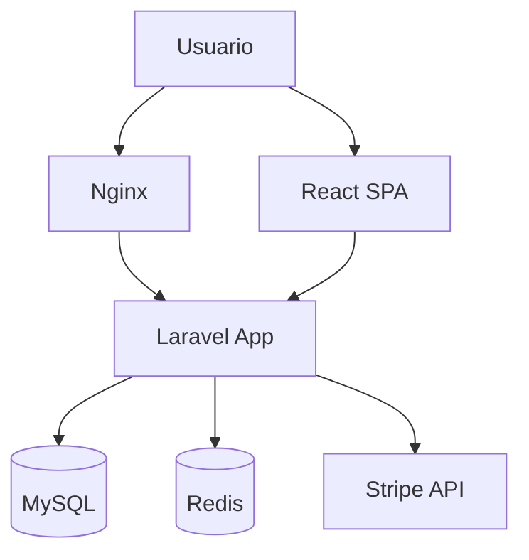
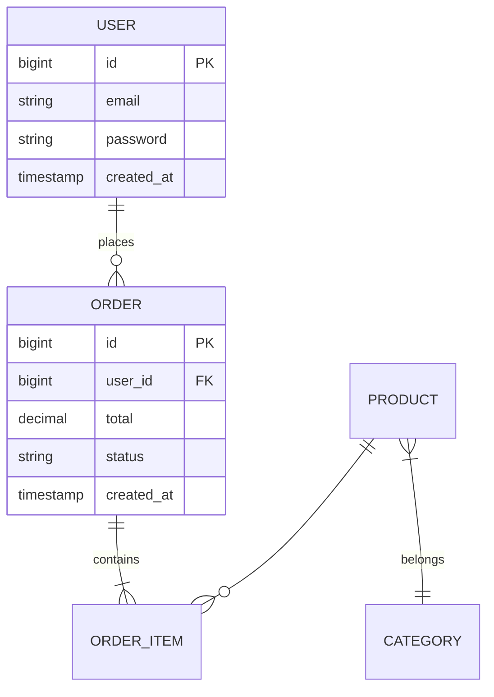
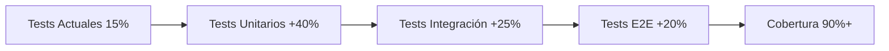

# Workflow SpecLeap — Proyectos Existentes (Legacy)

## Problema

Los comandos actuales de SpecLeap asumen **proyectos nuevos** en `proyectos/[nombre]/` con CONTRATO.md ya existente.

**¿Qué pasa cuando:**
- Tienes un proyecto Laravel/React YA desarrollado en producción
- Quieres adoptar SpecLeap para trabajo futuro
- El proyecto NO tiene CONTRATO.md, ANEXOS.md, ni estructura SpecLeap

---

## Flujo Propuesto: Adopción de Proyecto Legacy

### Fase 1: Análisis del Proyecto Existente

**Objetivo:** Entender el proyecto actual para generar un CONTRATO retroactivo.

#### 1.1 Comando Nuevo: `adoptar`

```
Usuario: adoptar /ruta/a/mi-proyecto-legacy
```

**Lo que hace la IA:**

1. **Escanear estructura del proyecto:**
   ```bash
   tree -L 3 /ruta/a/mi-proyecto-legacy
   ls -la
   cat composer.json  # Laravel
   cat package.json   # React/Node
   ```

2. **Identificar stack tecnológico:**
   - Framework backend (Laravel, Symfony, etc.)
   - Framework frontend (React, Vue, etc.)
   - Base de datos (MySQL, PostgreSQL, etc.)
   - Servicios externos (APIs, MCPs, etc.)

3. **Leer archivos clave:**
   - README.md (si existe)
   - .env.example
   - Archivos de migración (database/)
   - Rutas principales (routes/, controllers/)
   - Componentes principales (resources/js/components/)

4. **Analizar arquitectura actual:**
   - Módulos principales
   - Modelos de datos
   - Relaciones entre entidades
   - Endpoints API
   - Vistas principales

#### 1.2 Output: Informe de Análisis

```markdown
## Análisis de Proyecto: mi-tienda-online

**Stack detectado:**
- Backend: Laravel 10.x
- Frontend: React 18 + Vite
- BD: MySQL 8.0
- Otros: Stripe, SendGrid, Redis

**Módulos identificados:**

1. **Autenticación**
   - Login/Registro
   - Reset password
   - OAuth (Google, Facebook)

2. **Catálogo de Productos**
   - CRUD productos
   - Categorías
   - Imágenes
   - Búsqueda

3. **Carrito de Compra**
   - Agregar/quitar items
   - Actualizar cantidades
   - Cupones descuento

4. **Checkout**
   - Formulario envío
   - Integración Stripe
   - Confirmación email

5. **Panel Admin**
   - Dashboard
   - Gestión productos
   - Órdenes
   - Usuarios

**Base de datos:**
- 15 tablas identificadas
- Relaciones: User hasMany Order, Product belongsToMany Category...

**APIs externas:**
- Stripe (pagos)
- SendGrid (emails)
- Google Maps (direcciones)

**¿Apruebas este análisis para generar el CONTRATO?** (s/n)
```

---

### Fase 2: Generación de CONTRATO Retroactivo

**Trigger:** Usuario aprueba el análisis

#### 2.1 La IA genera `CONTRATO.md`

**Diferencia con proyecto nuevo:**
- NO es especulativo (está basado en código real)
- Documenta LO QUE YA EXISTE
- Marca como "implementado" todo lo actual
- Identifica deuda técnica como "Pendiente refactor"

**Ejemplo:**

```markdown
# CONTRATO.md — mi-tienda-online

**Fecha inicio:** 2023-05-10 (proyecto original)  
**Fecha adopción SpecLeap:** 2026-02-21  
**Estado:** PRODUCCIÓN (adopción retroactiva)

---

## 1. Objetivo del Proyecto

Plataforma e-commerce completa para venta de productos físicos con integración de pagos y envíos.

**Alcance actual implementado:**
- ✅ Catálogo de productos (15 productos activos)
- ✅ Carrito de compra
- ✅ Checkout con Stripe
- ✅ Panel admin básico
- ✅ Sistema de usuarios

---

## 2. Stack Tecnológico

### Backend
- **Framework:** Laravel 10.48.10
- **Base de Datos:** MySQL 8.0.35
- **Cache:** Redis 7.0
- **Email:** SendGrid

### Frontend
- **Framework:** React 18.2.0
- **Build:** Vite 5.0.8
- **Estado:** Zustand
- **UI:** Tailwind CSS 3.4

---

## 3. Módulos y Funcionalidades

### Módulo: Autenticación ✅ IMPLEMENTADO
**Objetivo:** Gestión de usuarios y acceso seguro

**Funcionalidades:**
- ✅ Registro de usuarios
- ✅ Login con email/password
- ✅ Reset password
- ✅ OAuth Google
- ⚠️ Pendiente: OAuth Facebook (código existe pero deshabilitado)

**Tecnologías:**
- Laravel Sanctum
- Socialite
- React Router protected routes

**Archivos clave:**
- `app/Http/Controllers/Auth/`
- `resources/js/pages/Login.jsx`

---

### Módulo: Catálogo ✅ IMPLEMENTADO

[... etc ...]

---

## 4. Arquitectura



---

## 5. Base de Datos

### ERD



---

## 6. Deuda Técnica Identificada

**⚠️ Issues conocidos (documentar en ANEXOS):**

1. **Tests insuficientes**
   - Cobertura actual: ~15%
   - Falta: Tests E2E, tests integración Stripe

2. **Código duplicado**
   - Validaciones repetidas en 3 controllers
   - Lógica de descuentos en 2 lugares

3. **Performance**
   - N+1 queries en listado productos
   - Falta caché de categorías

4. **Seguridad**
   - Validación input mejorable
   - Rate limiting no configurado

**Acción:** Crear ANEXOS automáticamente para estos issues

---

## 7. Criterios de Aceptación (para trabajo futuro)

A partir de ahora, TODO trabajo nuevo debe:

- ✅ Tener tests con >=90% cobertura
- ✅ Pasar CodeRabbit review
- ✅ Seguir specs de SpecLeap (Laravel, React)
- ✅ Vincular ticket Jira
- ✅ Documentar en ANEXOS si expande CONTRATO

---

**FIN DEL CONTRATO**

Este documento es INMUTABLE. Cambios/mejoras → ANEXOS.md
```

---

### Fase 3: Generar ANEXOS Iniciales (Deuda Técnica)

**Automáticamente se crean ANEXOS para cada issue identificado:**

**ANEXOS.md:**

```markdown
# ANEXOS.md — mi-tienda-online

---

## ANEXO #001 — Mejorar Cobertura de Tests

**Fecha:** 2026-02-21  
**Tipo:** MEJORA  
**Prioridad:** ALTA  
**Ticket Jira:** SHOP-101 (auto-creado)

### Problema
Cobertura actual de tests: 15%  
Falta tests E2E, tests de integración Stripe

### Solución Propuesta
1. Agregar tests unitarios a todos los controllers
2. Tests E2E con Playwright para checkout
3. Tests de integración con Stripe modo test

### Criterios de Aceptación
- Cobertura >= 90%
- Tests E2E cubren checkout completo
- Tests Stripe mockean webhooks

### Diagrama



---

## ANEXO #002 — Eliminar Código Duplicado

[... etc ...]

---

## ANEXO #003 — Optimizar Queries N+1

[... etc ...]
```

---

### Fase 4: Integración con Estructura SpecLeap

#### 4.1 Mover/Copiar proyecto a `proyectos/`

**Opción A: Mover (proyecto se gestiona dentro de SpecLeap)**

```bash
mv /ruta/original/mi-tienda-online proyectos/mi-tienda-online
```

**Opción B: Symlink (proyecto queda en su ubicación original)**

```bash
ln -s /ruta/original/mi-tienda-online proyectos/mi-tienda-online
```

**Opción C: Solo documentación (código separado)**

```bash
mkdir proyectos/mi-tienda-online
# Solo se crea CONTRATO, ANEXOS, context/ (sin código)
```

#### 4.2 Crear estructura SpecLeap

```bash
proyectos/mi-tienda-online/
├── CONTRATO.md          # Generado en Fase 2
├── ANEXOS.md            # Generado en Fase 3
├── README.md            # Link al README original
├── context/
│   ├── architecture.md  # Auto-generado del análisis
│   ├── tech-stack.md    # Auto-generado
│   ├── decisions.md     # Vacío inicialmente
│   ├── conventions.md   # Detectadas del código
│   └── brief.md         # Resumen ejecutivo
├── [código del proyecto] # Si se movió/symlinkeó
└── .coderabbit.yaml     # Copiado
```

#### 4.3 Generar tickets Jira para deuda técnica

```
IA ejecuta: crear-tickets
```

Esto genera automáticamente:
- Epic: "Deuda Técnica mi-tienda-online"
- Stories: Uno por cada ANEXO
- Tasks: Subtareas específicas

---

### Fase 5: Workflow Normal desde Ahora

**A partir de aquí, el proyecto legacy funciona igual que uno nuevo:**

```
Usuario: Hola
IA: [lista proyectos incluyendo mi-tienda-online]

Usuario: mi-tienda-online
IA: [carga CONTRATO] ¿Qué vas a hacer hoy?

Usuario: refinar SHOP-101
IA: [lee el ANEXO #001, refina la spec de tests]

Usuario: planificar
IA: [genera plan de implementación para mejorar tests]

Usuario: implementar
IA: [desarrolla siguiendo el plan, actualiza el ANEXO]
```

---

## Comando Nuevo Necesario

### `adoptar` — Adoptar Proyecto Legacy

**Archivo:** `.commandsadoptar.md`

**Descripción:**
Analiza un proyecto existente fuera de SpecLeap y genera CONTRATO + ANEXOS retroactivos basados en el código real.

**Parámetros:**
- Ruta al proyecto legacy
- Tipo de proyecto (auto-detectado o manual)

**Flujo:**
1. Análisis automático del código
2. Informe de módulos, stack, arquitectura
3. Generación CONTRATO retroactivo
4. Generación ANEXOS para deuda técnica
5. Creación estructura SpecLeap
6. Generación tickets Jira
7. Proyecto listo para workflow normal

**Output:**
- `proyectos/[nombre]/CONTRATO.md`
- `proyectos/[nombre]/ANEXOS.md`
- `proyectos/[nombre]/context/*`
- Tickets Jira creados
- Proyecto adoptado ✅

---

## Casos de Uso

### Caso 1: E-commerce Legacy Laravel
Proyecto de 2 años, en producción, sin documentación formal.

**Workflow:**
```
adoptar ~/projects/old-shop
→ Análisis automático
→ CONTRATO generado (15 módulos identificados)
→ 8 ANEXOS de deuda técnica
→ 25 tickets Jira creados
→ Listo para trabajar con SpecLeap
```

### Caso 2: API Backend en Producción
API REST con 50 endpoints, sin specs.

**Workflow:**
```
adoptar ~/apis/customer-api
→ Análisis de routes/
→ Documentación de endpoints en CONTRATO
→ Identificación de endpoints sin tests
→ ANEXOS para mejorar documentación
→ Swagger auto-generado
```

### Caso 3: Frontend React Viejo
SPA React sin estructura clara.

**Workflow:**
```
adoptar ~/frontends/dashboard
→ Análisis de componentes
→ Árbol de dependencias en CONTRATO
→ Identificación de componentes duplicados
→ ANEXO para refactor
→ Component library propuesta
```

---

## Pendiente de Implementar

**Para que esto funcione necesitamos:**

1. ✅ **Comando `adoptar`** (.commandsadoptar.md)
2. ✅ **Lógica de análisis automático** (escaneo de código)
3. ✅ **Generación CONTRATO retroactivo** (basado en código existente)
4. ✅ **Detección deuda técnica** (patrones anti-pattern)
5. ✅ **Generación ANEXOS automáticos** (uno por issue)
6. ✅ **Integración con estructura proyectos/**
7. ✅ **Auto-creación tickets Jira** para deuda técnica

**¿Quieres que implemente el comando `adoptar` ahora?**
