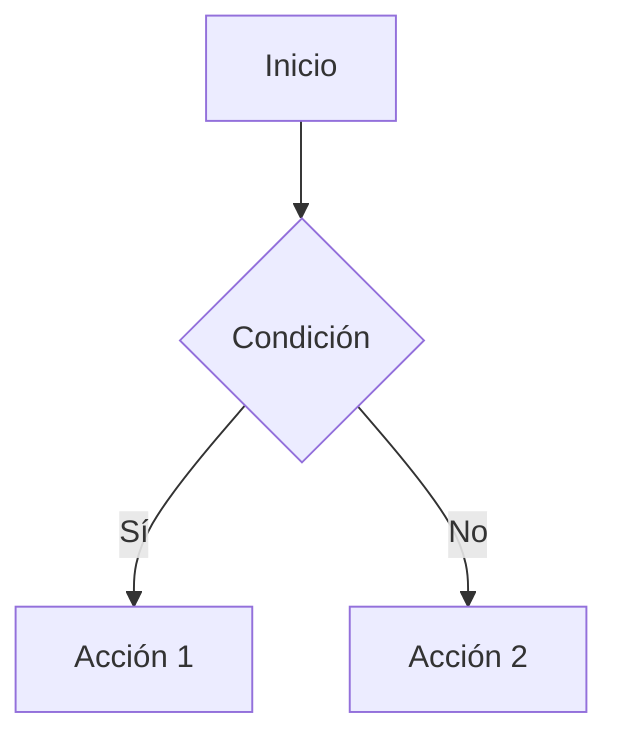
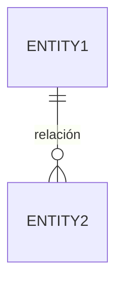

# OpenSpec — Formato de Especificaciones

## Estructura de Archivos

```
openspec/
├── specs/
│   ├── features/      # Specs de funcionalidades
│   ├── requirements/  # Requisitos del sistema
│   └── scenarios/     # Escenarios de uso
├── SPEC-FORMAT.md     # Este archivo
└── INDEX.md           # Índice de todas las specs
```

## Formato de Archivo .spec.md

```markdown
# [SPEC-ID] Nombre de la Especificación

| Campo | Valor |
|-------|-------|
| ID | SPEC-XXX |
| Versión | 1.0.0 |
| Estado | draft / review / approved / implemented |
| Prioridad | critical / high / medium / low |
| Proyecto | nombre-proyecto |
| Autor | @usuario |
| Fecha | YYYY-MM-DD |

## Descripción

Descripción breve de qué hace esta especificación.

---

## Requisitos

### Requirement: Nombre del requisito

- The system SHALL [comportamiento obligatorio].
- The system SHOULD [comportamiento recomendado].
- The system MAY [comportamiento opcional].

---

## Escenarios

### Scenario: Nombre del escenario

- GIVEN [precondición]
- WHEN [acción del usuario]
- THEN [resultado esperado]
- AND [resultado adicional]

### Scenario: Otro escenario

- GIVEN [precondición]
- AND [otra precondición]
- WHEN [acción]
- THEN [resultado]

---

## Criterios de Aceptación

- [ ] CA-01: Descripción del criterio
- [ ] CA-02: Descripción del criterio
- [ ] CA-03: Descripción del criterio

---

## Dependencias

| Tipo | Spec ID | Descripción |
|------|---------|-------------|
| Depende de | SPEC-XXX | Razón |
| Requerido por | SPEC-YYY | Razón |

---

## Diagramas

### Flujo Principal



### Diagrama de Secuencia (si aplica)

```mermaid
sequenceDiagram
    Actor->>System: Acción
    System-->>Actor: Respuesta
```

### Modelo de Datos (si aplica)



---

## Notas Técnicas

Decisiones de implementación, restricciones, consideraciones.

---

## Historial de Cambios

| Versión | Fecha | Autor | Cambios |
|---------|-------|-------|---------|
| 1.0.0 | YYYY-MM-DD | @usuario | Versión inicial |
```

## Palabras Clave

| Palabra | Significado | Uso |
|---------|-------------|-----|
| **SHALL** | Obligatorio | Requisito que DEBE cumplirse |
| **SHOULD** | Recomendado | Requisito que DEBERÍA cumplirse |
| **MAY** | Opcional | Requisito que PUEDE cumplirse |
| **GIVEN** | Precondición | Estado inicial del escenario |
| **WHEN** | Acción | Lo que dispara el comportamiento |
| **THEN** | Resultado | Lo que debe ocurrir |
| **AND** | Continuación | Añade condiciones/resultados |

## Spec Deltas (Cambios)

Los cambios en specs se visualizan en Git diffs:

```diff
### Requirement: Session expiration
- The system SHALL expire sessions after a configured duration.
+ The system SHALL support configurable session expiration periods.

#### Scenario: Default session timeout
- GIVEN a user has authenticated
-- WHEN 24 hours pass without activity
+- WHEN 24 hours pass without "Remember me"
- THEN invalidate the session token

+ #### Scenario: Extended session with remember me
+ - GIVEN user checks "Remember me" at login
+ - WHEN 30 days have passed
+ - THEN invalidate the session token
+ - AND clear the persistent cookie
```

## Workflow con Git

1. **Crear spec** → Nuevo archivo en `openspec/specs/`
2. **Revisar spec** → PR con cambios, el diff muestra el delta
3. **Aprobar spec** → Merge a main, cambiar estado a `approved`
4. **Implementar** → Desarrollo según spec
5. **Cerrar** → Estado `implemented` + link al PR de código

## Integración con Jira

- Cada spec genera un ticket en Jira
- El ticket incluye link a la spec en el repo
- Los cambios de spec se comentan en el ticket
