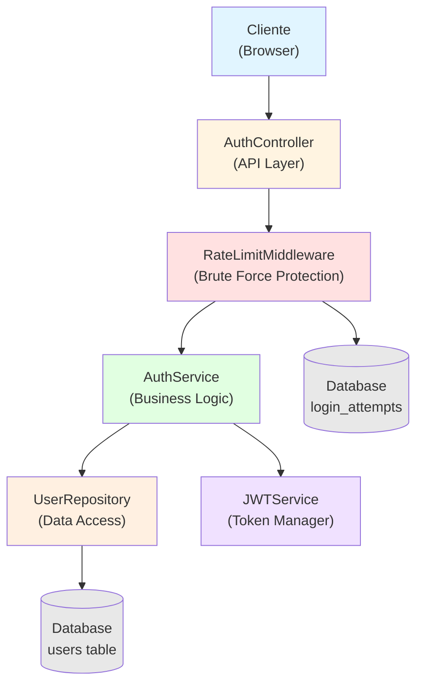
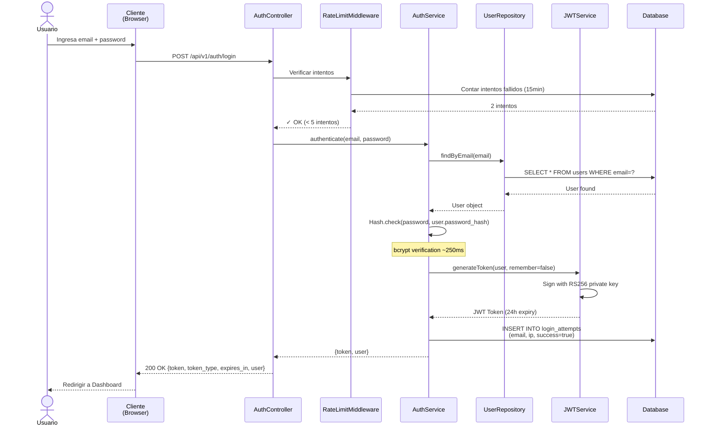

# [CHANGE-SAMPLE-001] Diseño Técnico: Autenticación de Usuario

| Campo | Valor |
|-------|-------|
| ID | CHANGE-SAMPLE-001 |
| Propuesta | `proposal.md` |
| Fecha | 2026-02-12 |
| Estado | approved |
| Arquitecto | SpecLeap Contributor |

## Resumen del Diseño

Sistema de autenticación basado en JWT con validación de credenciales contra base de datos, hashing bcrypt, rate limiting por IP, y middleware de autorización para rutas protegidas.

## Arquitectura

### Diagrama de Componentes



**Diagrama ASCII (alternativo):**
```
┌─────────────┐     ┌─────────────────┐     ┌─────────────────┐
│   Cliente   │────▶│  AuthController │────▶│  AuthService    │
│  (Browser)  │◀────│  (API Layer)    │◀────│ (Business Logic)│
└─────────────┘     └─────────────────┘     └─────────────────┘
                            │                        │
                            │                        ▼
                            │                ┌─────────────────┐
                            │                │ UserRepository  │
                            │                │   (Data Layer)  │
                            │                └─────────────────┘
                            │                        │
                            ▼                        ▼
                    ┌─────────────────┐     ┌─────────────────┐
                    │ RateLimiter     │     │   Database      │
                    │ (Middleware)    │     │  (users table)  │
                    └─────────────────┘     └─────────────────┘
                            │
                            ▼
                    ┌─────────────────┐
                    │  JWTService     │
                    │ (Token Manager) │
                    └─────────────────┘
```

### Componentes Afectados

| Componente | Tipo de Cambio | Descripción |
|------------|----------------|-------------|
| AuthController | Nuevo | Controlador de endpoints de autenticación |
| AuthService | Nuevo | Lógica de negocio de autenticación |
| UserRepository | Nuevo | Acceso a datos de usuarios |
| JWTService | Nuevo | Generación y validación de tokens |
| AuthMiddleware | Nuevo | Middleware de autorización para rutas |
| RateLimitMiddleware | Nuevo | Protección contra brute force |
| routes/api.php | Modificado | Registro de rutas de autenticación |

## Modelo de Datos

### Tabla Existente: `users`

```sql
CREATE TABLE users (
  id BIGINT UNSIGNED AUTO_INCREMENT PRIMARY KEY,
  email VARCHAR(255) UNIQUE NOT NULL,
  password_hash VARCHAR(255) NOT NULL,
  created_at TIMESTAMP DEFAULT CURRENT_TIMESTAMP,
  updated_at TIMESTAMP DEFAULT CURRENT_TIMESTAMP ON UPDATE CURRENT_TIMESTAMP,
  INDEX idx_email (email)
) ENGINE=InnoDB DEFAULT CHARSET=utf8mb4 COLLATE=utf8mb4_unicode_ci;
```

### Nueva Tabla: `login_attempts`

```sql
CREATE TABLE login_attempts (
  id BIGINT UNSIGNED AUTO_INCREMENT PRIMARY KEY,
  email VARCHAR(255) NOT NULL,
  ip_address VARCHAR(45) NOT NULL,
  user_agent TEXT,
  success BOOLEAN DEFAULT FALSE,
  attempted_at TIMESTAMP DEFAULT CURRENT_TIMESTAMP,
  INDEX idx_email_ip (email, ip_address),
  INDEX idx_attempted_at (attempted_at)
) ENGINE=InnoDB DEFAULT CHARSET=utf8mb4 COLLATE=utf8mb4_unicode_ci;
```

### Migraciones de Base de Datos

```sql
-- Migration: 20260212000001_create_login_attempts_table.sql
CREATE TABLE login_attempts (
  id BIGINT UNSIGNED AUTO_INCREMENT PRIMARY KEY,
  email VARCHAR(255) NOT NULL,
  ip_address VARCHAR(45) NOT NULL,
  user_agent TEXT,
  success BOOLEAN DEFAULT FALSE,
  attempted_at TIMESTAMP DEFAULT CURRENT_TIMESTAMP,
  INDEX idx_email_ip (email, ip_address),
  INDEX idx_attempted_at (attempted_at)
) ENGINE=InnoDB DEFAULT CHARSET=utf8mb4 COLLATE=utf8mb4_unicode_ci;
```

## API / Interfaces

### Nuevos Endpoints

```
POST /api/v1/auth/login
POST /api/v1/auth/logout
POST /api/v1/auth/refresh
GET  /api/v1/auth/me
```

### Contratos de API

#### POST /api/v1/auth/login

**Request:**
```json
{
  "email": "usuario@example.com",
  "password": "contraseña_segura",
  "remember": false
}
```

**Response (200 OK):**
```json
{
  "token": "eyJhbGciOiJSUzI1NiIsInR5cCI6IkpXVCJ9...",
  "token_type": "Bearer",
  "expires_in": 86400,
  "user": {
    "id": 123,
    "email": "usuario@example.com"
  }
}
```

**Response (401 Unauthorized):**
```json
{
  "error": "Credenciales inválidas"
}
```

**Response (429 Too Many Requests):**
```json
{
  "error": "Cuenta temporalmente bloqueada por intentos fallidos. Intente nuevamente en 30 minutos."
}
```

#### POST /api/v1/auth/logout

**Headers:**
```
Authorization: Bearer {token}
```

**Response (200 OK):**
```json
{
  "message": "Sesión cerrada exitosamente"
}
```

#### GET /api/v1/auth/me

**Headers:**
```
Authorization: Bearer {token}
```

**Response (200 OK):**
```json
{
  "id": 123,
  "email": "usuario@example.com",
  "created_at": "2026-01-15T10:30:00Z"
}
```

## Flujo de Datos

### Secuencia Principal: Login Exitoso



### Casos de Error

| Código | Escenario | Respuesta |
|--------|-----------|-----------|
| 400 | Email/password faltantes | `{ error: "Email y contraseña son requeridos" }` |
| 401 | Credenciales inválidas | `{ error: "Credenciales inválidas" }` |
| 429 | Cuenta bloqueada | `{ error: "Cuenta temporalmente bloqueada..." }` |
| 500 | Error interno (DB, etc.) | `{ error: "Error del servidor, intente más tarde" }` |

## Seguridad

### Autenticación/Autorización

- **Método de autenticación:** JWT con firma RS256
- **Duración del token:** 24 horas (normal) / 30 días (remember me)
- **Roles con acceso:** Ninguno (endpoint público)
- **Rutas protegidas:** Aplicar `AuthMiddleware` a rutas que requieran autenticación

### Validación de Inputs

- **email:** string, formato email válido, max 255 chars, sanitizado
- **password:** string, min 8 chars, max 255 chars, no sanitizado (hash directo)
- **remember:** boolean, opcional

### Hashing de Contraseñas

```php
// Registro (no en este CHANGE, pero para contexto)
$hash = Hash::make($password); // bcrypt cost=12

// Login
Hash::check($password, $user->password_hash);
```

### Rate Limiting

- **Límite:** 5 intentos fallidos por IP + email en 15 minutos
- **Bloqueo:** 30 minutos
- **Desbloqueo:** Automático tras expiración
- **Override manual:** Admin puede desbloquear desde DB

### Consideraciones de Seguridad

- [x] CSRF protection (tokens en formularios web)
- [x] Rate limiting (brute force protection)
- [x] Input sanitization (email)
- [x] SQL injection prevention (ORM/prepared statements)
- [x] XSS prevention (no renderizar inputs sin escapar)
- [x] HTTPS obligatorio en producción
- [x] Headers de seguridad:
  - `X-Content-Type-Options: nosniff`
  - `X-Frame-Options: DENY`
  - `Content-Security-Policy: default-src 'self'`
- [x] Logging de intentos para auditoría
- [x] Tokens HttpOnly (no accesibles desde JavaScript)

## Performance

### Estimaciones de Carga

- **Requests esperados:** 50 logins/minuto en hora pico
- **Usuarios concurrentes:** ~100 logins simultáneos
- **Tamaño de respuesta:** ~500 bytes (JSON + token)

### Optimizaciones

#### Índices de Base de Datos

```sql
-- Ya existente en users
INDEX idx_email (email)

-- Nuevos en login_attempts
INDEX idx_email_ip (email, ip_address)
INDEX idx_attempted_at (attempted_at)
```

#### Caché Strategy

- **Validación de tokens:** Cachear public key para verificación (Redis, 1 hora)
- **Rate limiting counters:** Redis con TTL de 15 minutos
- **No cachear:** Credenciales, tokens generados

#### Paginación

No aplica (endpoints no devuelven listas).

## Testing Strategy

### Unit Tests

- [x] **AuthService:**
  - `test_authenticate_with_valid_credentials()`
  - `test_authenticate_with_invalid_password()`
  - `test_authenticate_with_nonexistent_email()`
- [x] **JWTService:**
  - `test_generate_token_with_user()`
  - `test_validate_valid_token()`
  - `test_validate_expired_token()`
  - `test_validate_tampered_token()`
- [x] **RateLimitMiddleware:**
  - `test_allows_requests_under_limit()`
  - `test_blocks_requests_over_limit()`
  - `test_resets_counter_after_timeout()`

### Integration Tests

- [x] **POST /api/v1/auth/login:**
  - `test_login_success_with_valid_credentials()`
  - `test_login_fails_with_invalid_password()`
  - `test_login_fails_with_nonexistent_email()`
  - `test_login_blocked_after_5_failed_attempts()`
  - `test_login_with_remember_me_extends_token_expiry()`
- [x] **POST /api/v1/auth/logout:**
  - `test_logout_invalidates_token()`
  - `test_logout_fails_without_token()`
- [x] **GET /api/v1/auth/me:**
  - `test_returns_user_with_valid_token()`
  - `test_fails_with_expired_token()`

### E2E Tests (si aplica)

- [x] Flujo completo: Login → Acceder a ruta protegida → Logout
- [x] Flujo de bloqueo: 5 intentos fallidos → Bloqueo → Espera 30min → Reintento exitoso

## Plan de Rollback

### Pasos para Revertir

1. **Código:**
   ```bash
   git revert <commit-hash>
   git push origin main
   ```

2. **Migración de BD:**
   ```sql
   DROP TABLE IF EXISTS login_attempts;
   ```

3. **Caché:**
   ```bash
   redis-cli FLUSHDB
   ```

4. **Rutas protegidas:** Comentar `AuthMiddleware` temporalmente

### Datos a Preservar

- **Tabla `users`:** NO tocar (ya existente)
- **Tabla `login_attempts`:** Puede eliminarse (solo auditoría)
- **Tokens activos:** Se invalidarán automáticamente al revertir

## Decisiones Técnicas (ADR)

### ADR-001: JWT con RS256 en lugar de HS256

**Contexto:** Necesitamos decidir algoritmo de firma de tokens JWT.

**Alternativas:**
- **HS256:** Firma simétrica (misma clave para generar y validar)
- **RS256:** Firma asimétrica (clave privada para generar, pública para validar)

**Decisión:** Elegimos **RS256**.

**Razones:**
- Permite validación de tokens en servicios sin acceso a clave privada
- Mayor seguridad (comprometer clave pública no permite generar tokens falsos)
- Estándar en sistemas distribuidos

**Consecuencias:**
- ✅ Mejor seguridad y escalabilidad
- ⚠️ Ligeramente más lento que HS256 (despreciable en nuestra carga)
- ⚠️ Requiere gestión de par de claves RSA

### ADR-002: Bcrypt cost factor = 12

**Contexto:** Definir balance entre seguridad y performance para hashing.

**Decisión:** Bcrypt con cost factor **12**.

**Razones:**
- OWASP recomienda mínimo 10, ideal 12-14
- Cost 12 toma ~250ms en hardware moderno (aceptable para login)
- Protege contra GPUs de ataques offline

**Consecuencias:**
- ✅ Resistencia fuerte contra brute force offline
- ⚠️ ~250ms por hash (solo en login/registro, no es problema)

### ADR-003: Rate limiting por IP + Email

**Contexto:** Decidir granularidad del rate limiting.

**Alternativas:**
- Solo por IP
- Solo por email
- IP + email

**Decisión:** **IP + email** combinados.

**Razones:**
- Previene ataques distribuidos (múltiples IPs a mismo email)
- Previene bloqueo global de una IP compartida

**Consecuencias:**
- ✅ Protección más robusta
- ⚠️ Requiere índice compuesto en `login_attempts`

## Referencias

- Propuesta: `proposal.md`
- Spec principal: `openspec/specs/functional/F001-authentication.spec.md`
- Delta specs: `specs/functional/F001-authentication.spec.md`
- JWT RFC: https://tools.ietf.org/html/rfc7519
- OWASP Auth Cheat Sheet: https://cheatsheetseries.owasp.org/cheatsheets/Authentication_Cheat_Sheet.html
