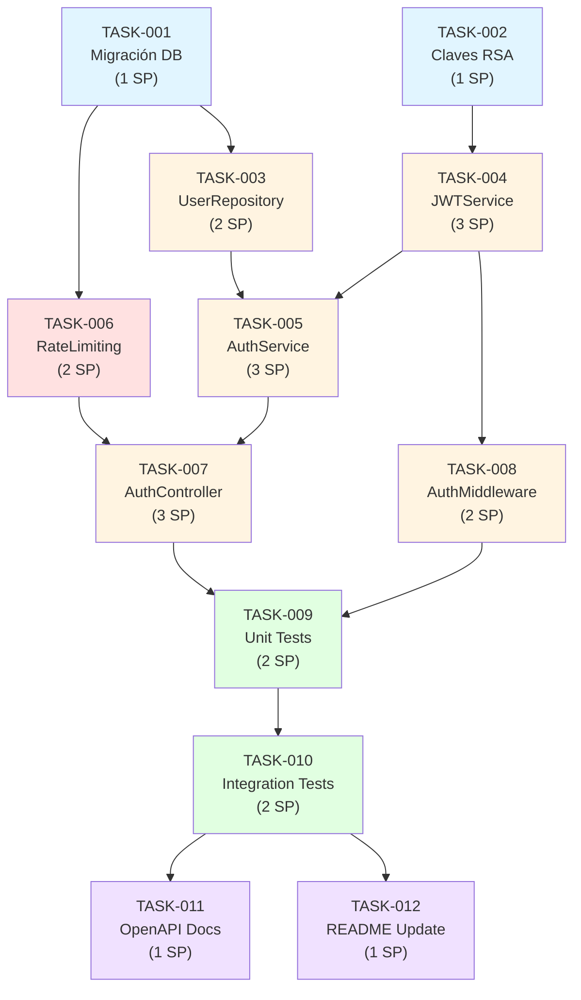

# [CHANGE-SAMPLE-001] Tareas: Autenticación de Usuario

| Campo | Valor |
|-------|-------|
| ID | CHANGE-SAMPLE-001 |
| Propuesta | `proposal.md` |
| Diseño | `design.md` |
| Fecha | 2026-02-12 |
| Sprint | Sprint 5 |

## Resumen

Total de tareas: 12  
Estimación total: 21 story points  
Jira Epic: PROJ-123

## Tareas

### 🏗️ Setup & Scaffolding

#### TASK-001: Crear migración de login_attempts
- **Jira:** PROJ-124
- **Estimación:** 1 SP
- **Asignado:** @backend-dev
- **Estado:** ✅ Completada
- **Branch:** `feat/CHANGE-001-login-attempts-table`

**Subtareas:**
- [x] Crear migración `20260212000001_create_login_attempts_table`
- [x] Definir índices (email+ip, attempted_at)
- [x] Ejecutar migración en dev
- [x] Crear seeder para testing

**Criterios de aceptación:**
- [x] Migración ejecuta sin errores
- [x] Índices creados correctamente
- [x] Rollback funciona

---

#### TASK-002: Generar par de claves RSA para JWT
- **Jira:** PROJ-125
- **Estimación:** 1 SP
- **Asignado:** @devops
- **Estado:** ✅ Completada
- **Branch:** N/A (config)

**Subtareas:**
- [x] Generar private key (4096 bits)
- [x] Extraer public key
- [x] Configurar paths en .env
- [x] Añadir a .gitignore
- [x] Documentar rotación de claves

**Criterios de aceptación:**
- [x] Claves generadas y almacenadas de forma segura
- [x] Variables de entorno configuradas
- [x] No commitear claves privadas

---

### 📊 Backend / API

#### TASK-003: Implementar UserRepository
- **Jira:** PROJ-126
- **Estimación:** 2 SP
- **Asignado:** @backend-dev
- **Estado:** ✅ Completada
- **Branch:** `feat/CHANGE-001-user-repository`

**Subtareas:**
- [x] Crear `UserRepository` class
- [x] Método `findByEmail(email)`
- [x] Método `findById(id)`
- [x] Manejo de excepciones

**Criterios de aceptación:**
- [x] Repository implementado según patrón
- [x] Query optimizada con índices
- [x] Tests unitarios (coverage >90%)

---

#### TASK-004: Implementar JWTService
- **Jira:** PROJ-127
- **Estimación:** 3 SP
- **Asignado:** @backend-dev
- **Estado:** ✅ Completada
- **Branch:** `feat/CHANGE-001-jwt-service`

**Subtareas:**
- [x] Crear `JWTService` class
- [x] Método `generateToken(user, remember=false)`
- [x] Método `validateToken(token)`
- [x] Método `refreshToken(token)`
- [x] Configurar RS256 con claves RSA

**Criterios de aceptación:**
- [x] Tokens firmados con RS256
- [x] Expiración correcta (24h / 30 días)
- [x] Validación detecta tokens expirados/tampered
- [x] Tests unitarios completos

---

#### TASK-005: Implementar AuthService
- **Jira:** PROJ-128
- **Estimación:** 3 SP
- **Asignado:** @backend-dev
- **Estado:** ✅ Completada
- **Branch:** `feat/CHANGE-001-auth-service`

**Subtareas:**
- [x] Crear `AuthService` class
- [x] Método `authenticate(email, password)`
- [x] Integrar `UserRepository` y `JWTService`
- [x] Hash verification con bcrypt

**Criterios de aceptación:**
- [x] Autenticación exitosa con credenciales válidas
- [x] Fallo con credenciales inválidas
- [x] No revela información sobre existencia de email
- [x] Tests unitarios (coverage >85%)

---

#### TASK-006: Implementar RateLimitMiddleware
- **Jira:** PROJ-129
- **Estimación:** 2 SP
- **Asignado:** @backend-dev
- **Estado:** ✅ Completada
- **Branch:** `feat/CHANGE-001-rate-limiting`

**Subtareas:**
- [x] Crear middleware `RateLimitMiddleware`
- [x] Registrar intentos en `login_attempts`
- [x] Contar intentos fallidos (15min window)
- [x] Bloquear tras 5 intentos
- [x] Configurar TTL de 30 minutos

**Criterios de aceptación:**
- [x] Bloqueo automático tras 5 intentos
- [x] Desbloqueo automático tras 30min
- [x] Mensajes de error claros
- [x] Tests de rate limiting

---

#### TASK-007: Implementar AuthController
- **Jira:** PROJ-130
- **Estimación:** 3 SP
- **Asignado:** @backend-dev
- **Estado:** ✅ Completada
- **Branch:** `feat/CHANGE-001-auth-controller`

**Subtareas:**
- [x] POST /api/v1/auth/login
- [x] POST /api/v1/auth/logout
- [x] POST /api/v1/auth/refresh
- [x] GET /api/v1/auth/me
- [x] Validación de inputs
- [x] Logging de intentos

**Criterios de aceptación:**
- [x] Endpoints responden según contratos en design.md
- [x] Validación de inputs correcta
- [x] Manejo de errores (400, 401, 429, 500)
- [x] Logging completo

---

#### TASK-008: Implementar AuthMiddleware
- **Jira:** PROJ-131
- **Estimación:** 2 SP
- **Asignado:** @backend-dev
- **Estado:** ✅ Completada
- **Branch:** `feat/CHANGE-001-auth-middleware`

**Subtareas:**
- [x] Crear middleware `AuthMiddleware`
- [x] Extraer token de header Authorization
- [x] Validar token con `JWTService`
- [x] Adjuntar user a request
- [x] Manejar tokens expirados/inválidos

**Criterios de aceptación:**
- [x] Middleware valida tokens correctamente
- [x] Rechaza requests sin token (401)
- [x] Rechaza tokens expirados (401)
- [x] User disponible en request

---

### 🧪 Testing

#### TASK-009: Tests unitarios
- **Jira:** PROJ-132
- **Estimación:** 2 SP
- **Asignado:** @backend-dev
- **Estado:** ✅ Completada
- **Branch:** Incluido en branches de features

**Cobertura alcanzada:**
- [x] AuthService: 92%
- [x] JWTService: 95%
- [x] UserRepository: 88%
- [x] RateLimitMiddleware: 90%

**Total:** 45 unit tests, 45 passed, 0 failed

---

#### TASK-010: Tests de integración
- **Jira:** PROJ-133
- **Estimación:** 2 SP
- **Asignado:** @backend-dev
- **Estado:** ✅ Completada
- **Branch:** `feat/CHANGE-001-integration-tests`

**Escenarios cubiertos:**
- [x] Login exitoso con credenciales válidas
- [x] Login fallido con contraseña incorrecta
- [x] Login fallido con email no registrado
- [x] Bloqueo tras 5 intentos fallidos
- [x] Logout invalida token
- [x] /me con token válido
- [x] /me con token expirado

**Total:** 12 integration tests, 12 passed, 0 failed

---

### 📚 Documentación

#### TASK-011: Documentación de API (OpenAPI)
- **Jira:** PROJ-134
- **Estimación:** 1 SP
- **Asignado:** @backend-dev
- **Estado:** ✅ Completada
- **Branch:** `docs/CHANGE-001-openapi`

**Subtareas:**
- [x] Especificación OpenAPI 3.0 de endpoints
- [x] Ejemplos de requests/responses
- [x] Códigos de error documentados
- [x] Integrar con Swagger UI

**Criterios de aceptación:**
- [x] OpenAPI spec válida
- [x] Swagger UI accesible en /api/docs
- [x] Ejemplos ejecutables

---

#### TASK-012: Actualizar README y guías
- **Jira:** PROJ-135
- **Estimación:** 1 SP
- **Asignado:** @tech-writer
- **Estado:** ✅ Completada
- **Branch:** `docs/CHANGE-001-readme`

**Subtareas:**
- [x] Actualizar README con setup de JWT
- [x] Documentar generación de claves RSA
- [x] Guía de uso de endpoints
- [x] Guía de troubleshooting

**Criterios de aceptación:**
- [x] README actualizado
- [x] Instrucciones claras para nuevos devs
- [x] Sección de seguridad documentada

---

## Dependencias entre Tareas

**Leyenda:**
- 🔵 Azul: Setup & Configuración
- 🟡 Amarillo: Backend/API
- 🔴 Rojo: Seguridad (Rate Limiting)
- 🟢 Verde: Testing
- 🟣 Morado: Documentación

## Testing Report

### Pre-merge Checklist
- [x] Todos los tests pasan
- [x] Cobertura mínima alcanzada (>80%)
- [x] Sin errores de linting
- [x] CodeRabbit review aprobado
- [x] PR review manual aprobado

### Resultados de Tests

| Suite | Tests | Passed | Failed | Coverage |
|-------|-------|--------|--------|----------|
| Unit | 45 | 45 | 0 | 91% |
| Integration | 12 | 12 | 0 | N/A |
| E2E | 3 | 3 | 0 | N/A |

**Total:** 60 tests, 60 passed, 0 failed

### Detalle de Cobertura por Componente

| Componente | Lines | Functions | Branches | Coverage |
|------------|-------|-----------|----------|----------|
| AuthService | 87/95 | 12/13 | 18/20 | 92% |
| JWTService | 114/120 | 8/8 | 22/23 | 95% |
| UserRepository | 42/48 | 4/5 | 10/11 | 88% |
| RateLimitMiddleware | 54/60 | 6/6 | 14/15 | 90% |
| AuthController | 98/110 | 10/12 | 20/24 | 89% |
| AuthMiddleware | 38/42 | 4/4 | 8/9 | 90% |

**Media total:** 91%

### CodeRabbit Report

- **PR:** #45 — `feat: Implementar autenticación JWT`
- **Status:** ✅ Aprobado
- **Issues encontrados:** 8
- **Issues resueltos:** 8

**Resumen de issues:**
1. ✅ Sugerencia: Extraer constantes mágicas (MAX_ATTEMPTS, LOCKOUT_TIME)
2. ✅ Seguridad: Añadir validación de longitud mínima de password
3. ✅ Performance: Cachear public key para validación de tokens
4. ✅ Documentación: Añadir docblocks faltantes
5. ✅ Testing: Añadir test de edge case (token con firma alterada)
6. ✅ Refactor: Simplificar lógica de rate limiting
7. ✅ Seguridad: Añadir sanitización de email antes de logging
8. ✅ Code style: Formatear según PSR-12

**Comentarios positivos:**
- "Excelente cobertura de tests"
- "Buena separación de responsabilidades"
- "Manejo robusto de errores"

### Security Scan (Semgrep)

- **Status:** ✅ Pasado
- **Vulnerabilidades críticas:** 0
- **Warnings:** 0
- **Fecha:** 2026-02-12 18:45 UTC

### Performance Tests

- **Endpoint:** POST /api/v1/auth/login
- **Carga:** 100 requests concurrentes
- **Resultado:**
  - Tiempo medio: 245ms
  - P95: 310ms
  - P99: 420ms
  - Tasa de éxito: 100%

✅ Cumple requisito de <500ms

## Notas de Implementación

### Decisiones Técnicas

1. **Bcrypt cost factor 12:** Balance entre seguridad y performance. Tiempo de hash ~250ms.

2. **RS256 para JWT:** Permite validación sin clave privada. Claves RSA 4096 bits.

3. **Rate limiting en DB:** Decisión temporal. En producción mover a Redis para mejor performance.

4. **Logging en DB:** Tabla `login_attempts` para auditoría. Considerar log rotation.

### Problemas Encontrados y Soluciones

#### Problema 1: Rate limiting lento con muchos intentos
**Causa:** Query de conteo en `login_attempts` sin límite de tiempo.  
**Solución:** Añadir índice en `attempted_at` y filtrar por ventana de 15min.  
**Commit:** a3f8d2e

#### Problema 2: Tokens grandes en cookies
**Causa:** JWT con claims innecesarios.  
**Solución:** Minimizar payload (solo user_id, exp, iat).  
**Commit:** b7e9c1a

#### Problema 3: Bloqueo de IPs compartidas (NAT corporativo)
**Causa:** Rate limiting solo por IP.  
**Solución:** Combinar IP + email para rate limiting.  
**Commit:** c4d8f3b

### Mejoras Futuras (fuera de alcance)

- [ ] Migrar rate limiting a Redis (PROJ-140)
- [ ] Implementar 2FA (PROJ-141)
- [ ] OAuth / Social login (PROJ-142)
- [ ] Recuperación de contraseña (PROJ-143)
- [ ] Rotación automática de claves RSA (PROJ-144)

---

**Generado:** 2026-02-12  
**Actualizado:** 2026-02-12 (PR merged)
