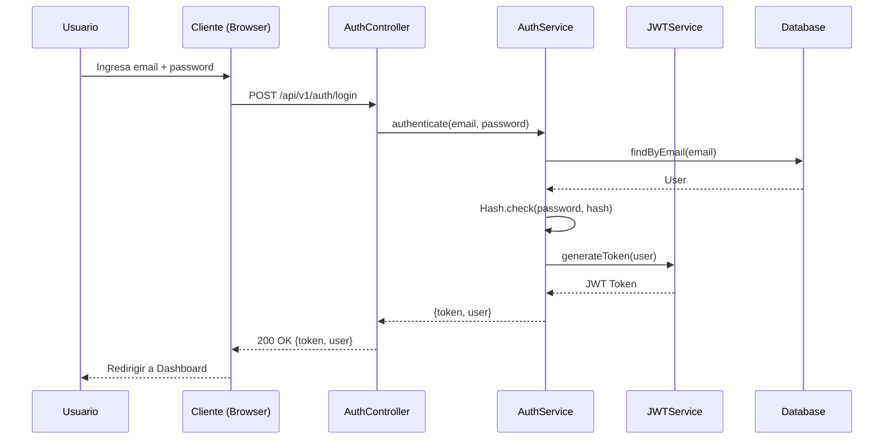
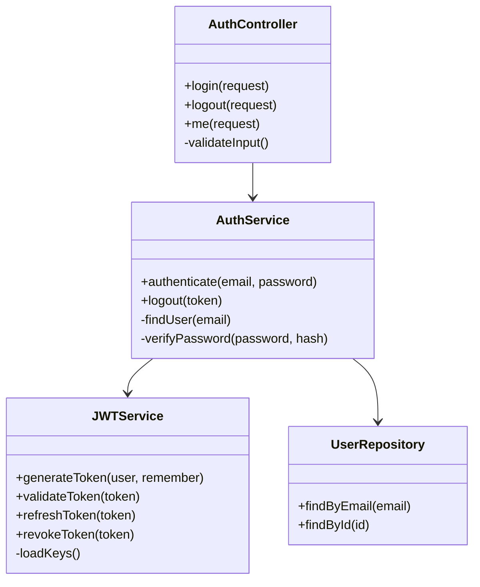
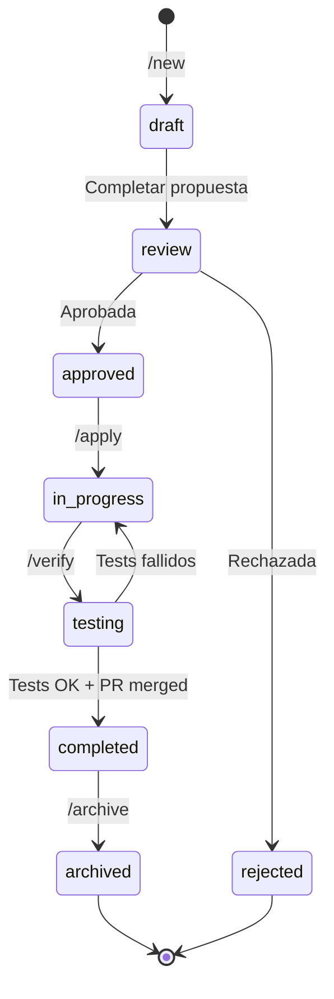
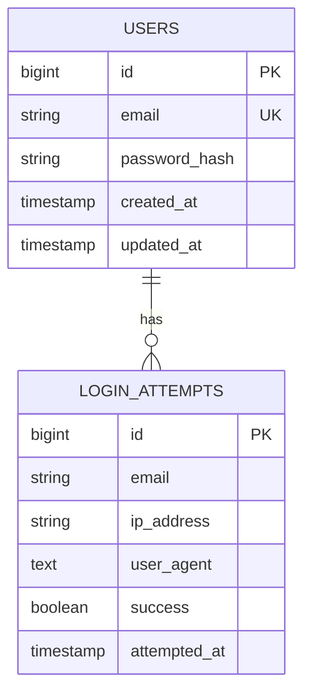
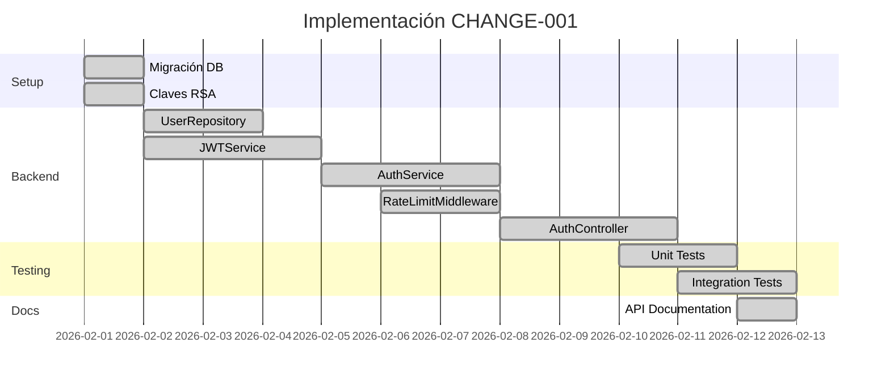
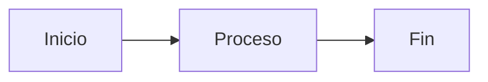
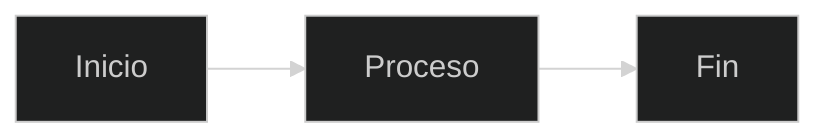
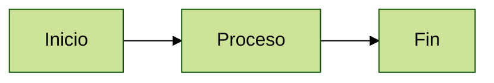

# 📊 Diagramas Mermaid en SpecLeap

Guía de uso de diagramas Mermaid para visualizar flujos, arquitectura, y secuencias en tus specs.

## ✅ Soporte Actual

### VSCode Local
✅ **Funciona con extensiones** — Instala las extensiones recomendadas:
- `shd101wyy.markdown-preview-enhanced` (recomendado)
- `bierner.markdown-mermaid` (alternativa)

### Cursor / Continue
✅ **Preview nativo** — Ambos IDEs renderizan Mermaid automáticamente en el preview de markdown.

### Web Browsers
✅ **Mermaid Live Editor** — [mermaid.live](https://mermaid.live) para testear y exportar diagramas.

---

## 📋 Tipos de Diagramas Disponibles

### 1. Flowchart (Diagramas de Flujo)

**Uso:** Flujos de proceso, decisiones, workflows

````markdown
```mermaid
flowchart TD
    A[User Story] --> B{¿Refinada?}
    B -->|No| C[/enrich User Story]
    B -->|Sí| D[/new Crear Propuesta]
    C --> D
    D --> E[/ff Generar con AI]
    E --> F[Revisar y Ajustar]
    F --> G[/apply Implementar]
    G --> H[Desarrollar Código]
    H --> I[/verify Tests + Specs]
    I --> J{¿Tests OK?}
    J -->|No| H
    J -->|Sí| K[/code-review Crear PR]
    K --> L[CodeRabbit Review]
    L --> M{¿Aprobado?}
    M -->|No| H
    M -->|Sí| N[/archive Completar]
```
````

**Resultado:**

```mermaid
flowchart TD
    A[User Story] --> B{¿Refinada?}
    B -->|No| C[/enrich User Story]
    B -->|Sí| D[/new Crear Propuesta]
    C --> D
    D --> E[/ff Generar con AI]
    E --> F[Revisar y Ajustar]
    F --> G[/apply Implementar]
    G --> H[Desarrollar Código]
    H --> I[/verify Tests + Specs]
    I --> J{¿Tests OK?}
    J -->|No| H
    J -->|Sí| K[/code-review Crear PR]
    K --> L[CodeRabbit Review]
    L --> M{¿Aprobado?}
    M -->|No| H
    M -->|Sí| N[/archive Completar]
```

---

### 2. Sequence Diagram (Diagramas de Secuencia)

**Uso:** Flujos de autenticación, llamadas API, interacciones entre componentes

````markdown

````

**Resultado:**


---

### 3. Class Diagram (Diagramas de Clases)

**Uso:** Arquitectura de componentes, relaciones entre clases

````markdown

````

**Resultado:**


---

### 4. State Diagram (Diagramas de Estado)

**Uso:** Ciclo de vida de propuestas, estados de features

````markdown

````

**Resultado:**


---

### 5. Entity Relationship Diagram (Diagramas ER)

**Uso:** Modelo de datos, relaciones entre tablas

````markdown

````

**Resultado:**


---

### 6. Gantt Chart (Cronogramas)

**Uso:** Planificación de tareas, sprints

````markdown

````

**Resultado:**


---

## 🎨 Temas de Color

Mermaid soporta diferentes temas:

### Tema Default (Claro)


### Tema Dark


### Tema Forest (Verde)


---

## 📝 Uso Recomendado en SpecLeap

### En proposal.md
```markdown
## Flujo de Usuario

```mermaid
flowchart TD
    Start[Usuario abre app] --> Login[Pantalla de login]
    Login --> Submit[Enviar credenciales]
    Submit --> Valid{¿Credenciales válidas?}
    Valid -->|Sí| Dashboard[Dashboard]
    Valid -->|No| Error[Mostrar error]
    Error --> Login
`` `
```

### En design.md
```markdown
## Arquitectura de Componentes

```mermaid
classDiagram
    Controller --> Service
    Service --> Repository
    Service --> ExternalAPI
`` `

## Secuencia de Login

```mermaid
sequenceDiagram
    Cliente->>API: POST /login
    API->>DB: Validar credenciales
    DB-->>API: User found
    API-->>Cliente: Token JWT
`` `
```

### En tasks.md
```markdown
## Dependencias entre Tareas

```mermaid
graph TD
    T001[TASK-001: Setup] --> T002[TASK-002: Backend]
    T001 --> T003[TASK-003: Frontend]
    T002 --> T004[TASK-004: Tests]
    T003 --> T004
    T004 --> T005[TASK-005: Docs]
`` `
```

---

## 🔧 Cómo Ver los Diagramas

### En VSCode Local
1. Abrir archivo `.md` con diagramas Mermaid
2. `Cmd+K V` para preview
3. Los diagramas se renderizan automáticamente

### En Cursor / Continue
1. Abrir archivo `.md` con diagramas Mermaid
2. Abrir preview con el atajo correspondiente
3. Los diagramas se renderizan automáticamente

---

## 🐛 Troubleshooting

### Diagrama no se renderiza en VSCode

**Solución 1:** Instalar Markdown Preview Enhanced
```bash
code --install-extension shd101wyy.markdown-preview-enhanced
```

**Solución 2:** Reload window
`Cmd+Shift+P` → "Reload Window"

### Diagrama muestra error de sintaxis

**Revisar:**
- ` ```mermaid ` debe estar en su propia línea
- Cierre con ` ``` ` en su propia línea
- Sintaxis correcta según tipo de diagrama
- Sin espacios extra antes de la etiqueta

### Diagrama se ve feo

**Ajustar tema:**


---

## 📚 Referencias

- [Mermaid Documentation](https://mermaid.js.org/)
- [Mermaid Live Editor](https://mermaid.live/) — Probar diagramas online

---

**Última actualización:** 2026-02-12
